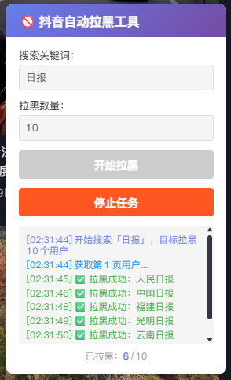

# 抖音搜索自动拉黑

针对抖音关键词搜索用户（如「日报」「新闻」等营销号）进行批量拉黑的油猴脚本。

[](https://github.com/Steven-Qiang/douyin-block-kit/actions/workflows/release.yml)
[](./LICENSE)
[](./package.json)



## 特性

- 关键词搜索用户
- 批量自动拉黑
- 实时进度显示
- 支持暂停/停止
- 自动跳过已拉黑用户
## 安装

1. 安装 [Tampermonkey](https://www.tampermonkey.net/)
2. [点击安装脚本](https://github.com/Steven-Qiang/douyin-block-kit/releases/latest/download/douyin-block-kit.user.js)
3. 访问 [抖音网页版](https://www.douyin.com)

## 使用

1. 登录抖音网页版
2. 右上角出现控制面板
3. 输入关键词（如：新闻、日报）
4. 设置拉黑数量
5. 点击开始

## 开发

```bash
pnpm install
pnpm run build
```

## License

MIT
